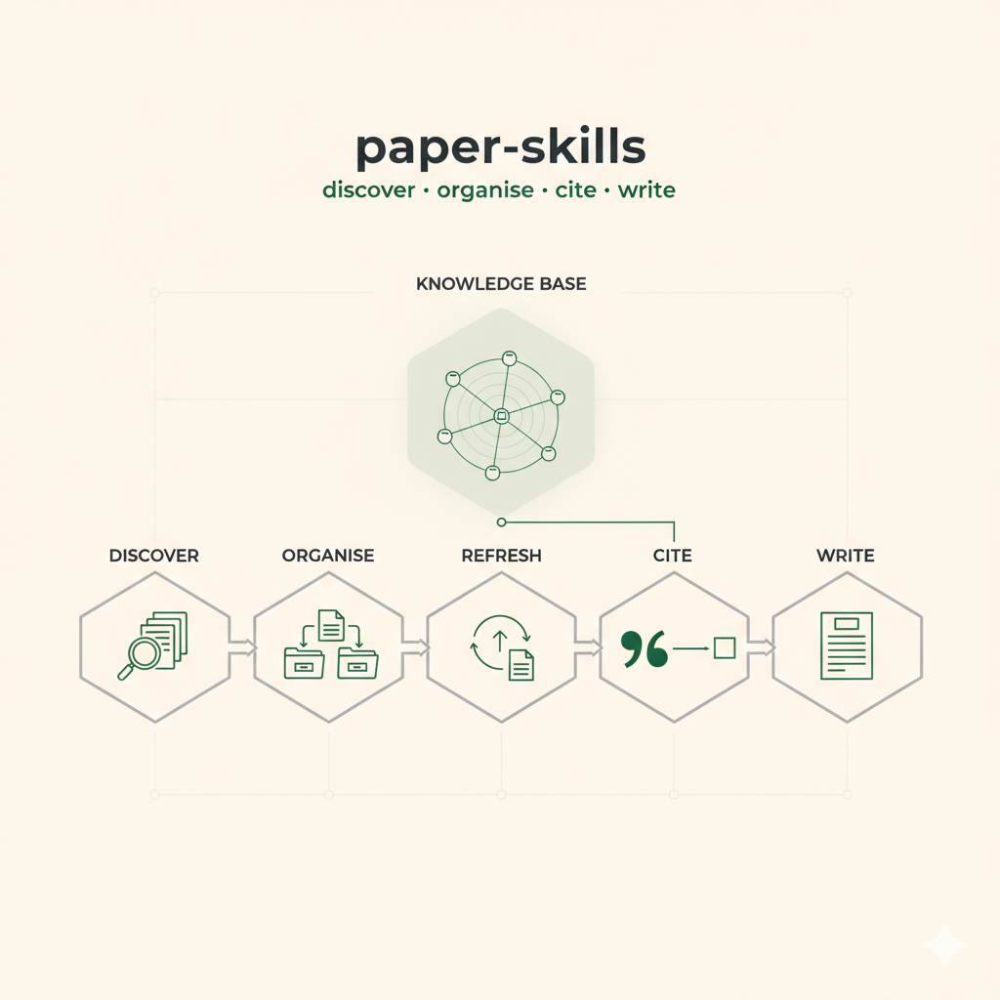

# paper-skills



**A kit of Claude Code skills for finding academic papers, building a local
bibliography, and writing papers.**

> [!TIP]
> **Easiest way to install:** clone this repo, open the folder in
> [Claude Code](https://claude.com/claude-code), and ask it — *"Read the README
> and install paper-skills, walking me through each step."* Claude Code runs the
> [`install-paper-skills`](.claude/skills/install-paper-skills/SKILL.md) skill
> and guides you the rest of the way. Full step-by-step details are in
> [Installing the skills](#installing-the-skills) below.

If you do research, you probably repeat the same loop: hunt for relevant
papers, download PDFs, keep a BibTeX file tidy, swap preprints for their
published versions, and make sure every citation in your draft actually
supports the sentence it's attached to. `paper-skills` packages that whole loop
as six installable [Claude Code](https://claude.com/claude-code) skills, plus a
one-command installer — so you can set it up once and hand the same workflow to
a colleague or a student.

It was built and tested with **Claude Code**, but the skills are plain Markdown
instruction files and the helper scripts are plain Python (standard library
only). Codex, or any other coding agent that can read a Markdown procedure and
run shell commands, can follow them too — see
[Using it with other agents](#using-it-with-other-agents).

> [!IMPORTANT]
> **These skills assist judgement; they do not replace it.** They are tools to
> *surface* problems — candidate papers worth reading, citations that look weak
> or missing, preprints that may be stale — and to *incentivise deeper
> analysis*, not to perform it for you. They do not read the papers on your
> behalf, decide what is true, or guarantee that a citation actually supports
> your claim. Treat every result as a prompt to look closer, not as an answer.
> Every reference, every claim, and every sentence in the final paper must be
> read, verified, and defended by a human — and the author remains solely
> responsible for the work.

---

## What's inside

| Skill | What it does |
|---|---|
| [`install-paper-skills`](.claude/skills/install-paper-skills/SKILL.md) | One-shot installer. Installs NotebookLM first, asks you to name your bibliography folder, scaffolds it, then installs the other five skills. |
| [`notebooklm`](skills/notebooklm/SKILL.md) | Full programmatic access to Google NotebookLM — create notebooks, add sources, ask grounded questions, generate podcasts / reports / mind maps. |
| [`bib-search`](skills/bib-search/SKILL.md) | Discover references. Checks your local catalog first, then queries arXiv, OpenAlex, Semantic Scholar, Crossref and DBLP, downloads open-access PDFs, and appends new entries to your master `refs.bib`. |
| [`bib-classify`](skills/bib-classify/SKILL.md) | Organise the library. Files every freshly downloaded PDF into a themed folder and rebuilds the catalog. |
| [`bib-upgrade`](skills/bib-upgrade/SKILL.md) | Keep the bibliography fresh. Sweeps for preprint → peer-reviewed upgrades (arXiv → journal/conference) and patches entries in place — cite-keys preserved. |
| [`claim-cite`](skills/claim-cite/SKILL.md) | Find the strongest citation for a specific claim sentence, ranked by evidence strength. |
| [`claims-audit`](skills/claims-audit/SKILL.md) | Audit a finished draft — check that every `\cite{}` actually supports its sentence, and flag claims that have no citation at all. |

Everything in this repo is generic: no personal data, no project names, no
private endpoints. The installer wires the skills to *your* chosen folder.

---

## How NotebookLM works (and what "vector search" means)

[NotebookLM](https://notebooklm.google.com) is Google's source-grounded research
assistant. The mental model:

1. **You create a notebook and add sources** — PDFs, web pages, YouTube videos,
   pasted text. A notebook is just a private collection of documents.
2. **NotebookLM indexes every source.** It splits each document into small
   passages ("chunks") and converts every chunk into an **embedding**: a list of
   numbers — a *vector* — that captures the passage's *meaning*. Passages about
   similar ideas end up as vectors that point in similar directions, even if
   they share no words.
3. **You ask a question.** NotebookLM embeds your question the same way, then
   does a **vector search** (also called *semantic search*): it finds the source
   chunks whose vectors are closest to the question's vector — "closest" usually
   measured by cosine similarity. This is the key difference from old-style
   keyword search: a keyword search for *"out of memory"* misses a paragraph
   that only says *"heap exhaustion"*; a vector search retrieves it, because the
   two phrases mean the same thing and so sit near each other in vector space.
4. **NotebookLM answers, grounded.** It writes the answer using *only* the
   retrieved chunks, with inline citations pointing back to the exact source
   passage. It does not free-associate from general training knowledge — if the
   notebook doesn't contain support for a claim, it tells you so.

This pattern — retrieve relevant chunks, then answer only from them — is called
**retrieval-augmented generation (RAG)**. Vector search is the "retrieve" half.

**Why this kit cares.** A NotebookLM notebook becomes a *private, citable
evidence base*. Drop your downloaded papers into a notebook, and:

- [`claim-cite`](skills/claim-cite/SKILL.md) can ask the notebook for the exact
  passage that supports a sentence you want to cite — not just a title that
  looks topically related.
- [`claims-audit`](skills/claims-audit/SKILL.md) can verify each citation in a
  draft against the *full text* of the source, catching the nasty case where an
  abstract looked right but the paper never actually makes the claim.

That is why [`install-paper-skills`](.claude/skills/install-paper-skills/SKILL.md)
installs and authenticates `notebooklm` **first** — the other skills lean on it.

---

## Requirements

- **[VS Code](https://code.visualstudio.com)** — the editor.
- **Claude Code** — the AI coding agent (VS Code extension or CLI).
- **Python 3.10+** — for the NotebookLM CLI and the bibliography tools.
- **A LaTeX distribution** — to build papers (TeX Live / MacTeX / MiKTeX).
- **[LaTeX Workshop](https://marketplace.visualstudio.com/items?itemName=James-Yu.latex-workshop)**
  (extension ID `James-Yu.latex-workshop`, by James Yu) — the recommended VS Code
  LaTeX extension. It builds your `.tex` on save and shows a live PDF preview.
- **`poppler-utils`** — provides the `pdftotext` command that `bib-classify`
  uses to read PDF first pages. Optional but recommended.

---

## Setting up VS Code, Claude Code and LaTeX

### 1. Install VS Code

Download it from [code.visualstudio.com](https://code.visualstudio.com) and
install for your platform.

### 2. Install the Claude Code extension

- Open VS Code → **Extensions** (the square icon in the sidebar, or
  `Ctrl+Shift+X` / `Cmd+Shift+X`).
- Search for **"Claude Code"** (published by Anthropic) and click **Install**.
- Open the Claude Code panel and **sign in** with your Anthropic account.
- Prefer the terminal? You can also install the CLI:
  `npm install -g @anthropic-ai/claude-code`, then run `claude` in any folder.

Claude Code also works in JetBrains IDEs and as a standalone CLI — the skills
behave the same in all of them.

### 3. Install LaTeX

| OS | How |
|---|---|
| **Linux (Debian/Ubuntu)** | `sudo apt install texlive-full latexmk` (or a smaller set: `texlive texlive-latex-extra texlive-bibtex-extra latexmk`). For PDF text extraction: `sudo apt install poppler-utils`. |
| **macOS** | Install [MacTeX](https://tug.org/mactex/) (`brew install --cask mactex`). For PDF text extraction: `brew install poppler`. |
| **Windows** | Install [MiKTeX](https://miktex.org/download) or [TeX Live](https://tug.org/texlive/). MiKTeX installs missing packages on demand. |

### 4. Install the LaTeX Workshop extension

In VS Code Extensions, search for **"LaTeX Workshop"** (by James Yu) and install
it. It builds your `.tex` file on save and shows a live PDF preview side by
side. Open the included [`paper-template/`](paper-template/) folder, save
`main.tex`, and you should get a PDF.

---

## Installing the skills

1. **Clone this repo:**
   ```bash
   git clone https://github.com/jhcontext/paper-skills.git
   cd paper-skills
   ```
2. **Open the `paper-skills` folder in VS Code.** Claude Code automatically
   discovers the installer skill in `.claude/skills/`.
3. **Run the installer** — in the Claude Code chat, type:
   ```
   /install-paper-skills
   ```
4. **Answer its questions.** It will:
   - install and set up the `notebooklm` skill (it opens a browser for a
     one-time Google sign-in);
   - ask you to **name your bibliography folder** (e.g. `paper-bib`) and where to
     put it;
   - scaffold that folder from [`bib-template/`](bib-template/);
   - install the remaining five skills into `~/.claude/skills/`, each wired to
     your chosen folder;
   - offer to `git init` the bibliography folder so you can version and share it.
5. **Restart Claude Code** (or reload the VS Code window) so the new slash
   commands appear.

That's it. The skills are now global — they work in any project you open.

> **No installer?** You can also bootstrap manually: copy
> `.claude/skills/install-paper-skills/` into `~/.claude/skills/`, restart Claude
> Code, then run `/install-paper-skills` from inside the cloned repo.

---

## Using the skills

### The bibliography loop

```
/bib-search "retrieval augmented generation for clinical notes"
```
Searches the open scholarly databases, downloads open-access PDFs into
`pdfs/_unclassified/`, and appends new entries to your master `refs.bib` and
catalog. Paywalled items come back as a list of things to download by hand.

```
/bib-classify
```
Files every PDF sitting in `pdfs/_unclassified/` into the right themed folder
(`agents-mas`, `healthcare-fhir`, …) and rebuilds the catalog.

```
/bib-upgrade --dry-run
```
Before a deadline, sweeps the catalog for preprints that now have a peer-reviewed
version and shows what it would change. Drop `--dry-run` to apply.

```
/claim-cite "LLM agents can hallucinate tool calls"
```
Returns a ranked shortlist of the strongest citations for that exact claim, with
supporting quotes.

### Writing a paper with Claude Code

1. **Start from the template.** Copy [`paper-template/`](paper-template/) into
   your bibliography folder as `papers/<paper-name>/`. The folder name is the
   label the skills use.
2. **Open the paper folder in VS Code.** LaTeX Workshop builds `main.tex` on
   save; the PDF preview updates live.
3. **Search as you write.** When you need a reference, run
   `/bib-search "<topic>" --for-paper <paper-name>` — it appends the entry to
   *both* your master catalog and the paper's local `refs.bib`, and gives you the
   `\cite{}` key to paste.
4. **Draft with Claude Code in plain language.** Ask things like:
   - *"Draft a Related Work section from the entries in refs.bib, grouped by
     theme."*
   - *"Tighten this abstract to 150 words and keep the contribution explicit."*
   - *"Turn these bullet points into a Method section."*
   Claude Code edits `main.tex` directly; you watch the PDF update.
5. **Pressure-test before submission:**
   ```
   /bib-upgrade  --for-paper <paper-name>
   /claims-audit --venue   <paper-name>
   ```
   `bib-upgrade` refreshes stale preprint citations; `claims-audit` checks that
   every `\cite{}` genuinely supports its sentence and flags uncited claims.

### Grounding citations with NotebookLM

For the strongest results, create a NotebookLM notebook for your paper and add
the PDFs you've collected (`/notebooklm` can do this). Then `claim-cite` and
`claims-audit` can verify citations against the *full text* of each source, not
just its abstract.

---

## Using it with other agents

This kit was built and tested with **Claude Code**, which is why the README
talks in slash commands like `/bib-search`. The skills themselves are not
Claude-specific:

- Each skill is a single `SKILL.md` — a plain-Markdown, step-by-step procedure.
  Any capable coding agent (Codex and similar) can be pointed at a `SKILL.md`
  and asked to follow it.
- The bibliography tools under `bib-template/tools/` are plain Python 3,
  standard library only — no Claude dependency, runnable on their own.
- The only external moving part is the NotebookLM CLI (`notebooklm-py`), which
  is an independent open package.

If your agent doesn't support auto-discovered skills, just open the relevant
`SKILL.md` and tell the agent: *"follow this procedure with the argument …"*.

---

## Repository layout

```
paper-skills/
├── README.md
├── LICENSE                       Apache License 2.0
├── .claude/skills/
│   └── install-paper-skills/     the installer (auto-discovered in this repo)
├── skills/                       the five skills the installer copies out
│   ├── notebooklm/
│   ├── bib-search/
│   ├── bib-classify/
│   ├── bib-upgrade/
│   ├── claim-cite/
│   └── claims-audit/
├── bib-template/                 scaffold for your bibliography folder
│   ├── README.md                 catalog schema + theme taxonomy + workflow
│   ├── refs.bib                  master BibTeX (starts empty)
│   ├── papers_inventory.csv      the catalog (starts empty)
│   ├── tools/                    Python maintenance scripts
│   ├── pdfs/<theme>/             PDFs filed by theme
│   └── papers/                   your LaTeX paper projects live here
├── paper-template/               a minimal LaTeX article to copy per paper
└── docs/
    └── cover-image-prompt.md     prompt for generating a repo cover image
```

---

## License

Released under the [Apache License 2.0](LICENSE).
